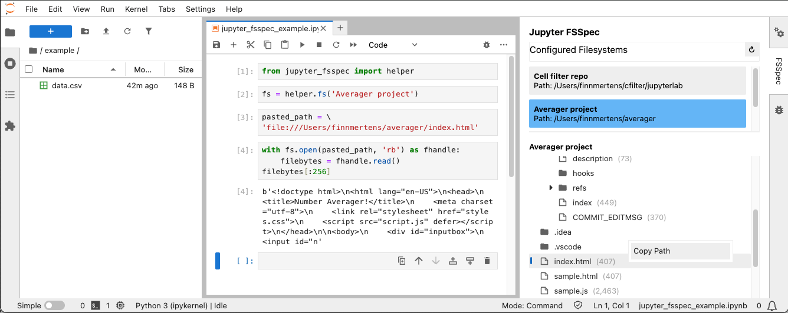

# Jupyter fsspec documentation



> 📘 **Note:** This project is in a pre-release state, in active development. Expect instability.

Welcome to the `jupyter_fsspec` documentation, the Jupyter extension for the `fsspec` Python library.

`jupyter_fsspec` provides a file browser for your `fsspec` filesystems using a config file, and a Python module (`jupyter_fsspec.helper`) for using your defined filesystems inside your notebook kernels.

## Installation

You can install `jupyter_fsspec` with pip, note that this extension is in pre-release so you'll need to add the `--pre` argument (make sure you've installed JupyterLab or another editor first):

`pip install --pre jupyter-fsspec`

Once installed, you will need to enable the Jupyter Server extension with:

`jupyter server extension enable jupyter_fsspec`

You can verify that the JupyterLab extension and Jupyter Server extension are enabled properly with:

```
jupyter labextension list
jupyter serverextension list
```

## Basic Usage

`jupyter_fsspec` lives in the JupyterLab right sidebar, and when you open it, you will
see a list of the filesystems you have defined in the config file (see below). When
you select one of them, you will see a file browser (tree view) of those files below.

Basic navigation works as you'd expect: Click to expand/collapse folders, and right click for
context options (such as copying the path of the current file to the clipboard).

## Config File

To define your `fsspec` filesystems, you will need to list them in the Jupyter config folder,
inside a file named `~/.jupyter/jupyter-fsspec.yaml`. Here's a sample file:

```
sources:
  - name: "Cell filter repo"
    path: "/Users/finnmertens/cfilter/jupyterlab"
    type: "file"
  - name: "Averager project"
    path: "file:///Users/finnmertens/averager"
    additional_options:
      anon: false
      key: "my-access-key"
      secret: "my-secret-key"
```

The config file has a list of sources, where each item needs a name and a path. The name
is a unique identifier, so don't use duplicate names.

You can also optionally specify a type (which is the type of filesystem `fsspec` should
construct). If you prefer you can omit the `type` argument and include the protocol in the
path instead (like in the second entry).

Last, you can pass additional arguments to the `fsspec` filesystem contructor by using the
`additional_options` key. You can check the `fsspec` docs for the available options that
each filesystem implementation offers.

## The `helper` module

You can import the `jupyter_fsspec.helper` module into your notebooks to interact with
filesystems defined in your config file:

```
# Import the helper module directly
from jupyter_fsspec import helper

# Get an fsspec filesystem using the config name
# (and use it as you would any fsspec filesystem)
fs = helper.filesystem('Averager project')

with fs.open('/My/file/path', 'rb') as fhandle:
    filebytes = fhandle.read()
filebytes[:256]
```

<!-- 
TODO populate this
```{toctree}
examples/content_child1.md
examples/content_child2.md
``` -->
